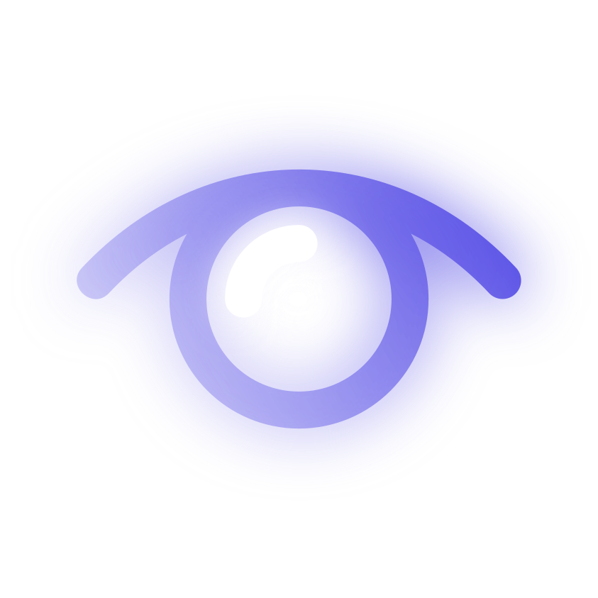
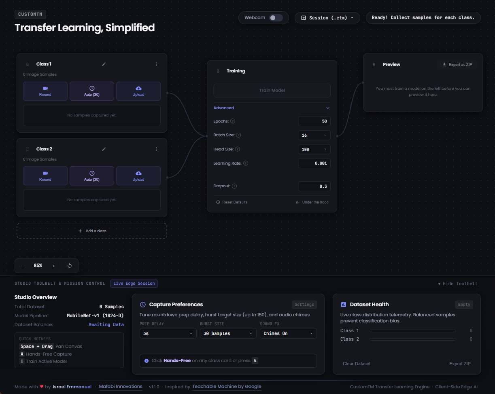

<p align="center">
  
</p>

<h1 align="center">CustomTM</h1>

<p align="center">
  <em>In-browser transfer learning engine for custom image classification — train on your GPU in seconds, zero backend required.</em>
</p>

<p align="center">
  
  
  
  
</p>

<p align="center">
  
</p>

---

## Overview

CustomTM is a professional-grade, dependency-free in-browser workbench for training custom image classifiers using transfer learning. Rather than relying on cloud APIs, opaque notebooks, or heavy Python environments, CustomTM gives you a complete visual training studio that runs entirely inside your browser — collecting samples via webcam, extracting MobileNet embeddings, training a classification head on your local GPU, and exporting production-ready TensorFlow.js models, all in a single session with zero build step or backend server.

## The Problem Solved

Traditional computer vision workflows force you into fragmented toolchains — Jupyter notebooks for training, separate scripts for data collection, cloud compute for GPU access, and manual export pipelines for deployment. CustomTM collapses the entire loop into one visual interface:

- **Eliminates Environment Setup:** No Python, no CUDA drivers, no `pip install`. Open a URL and start training.
- **Bridges Collection to Deployment:** Capture samples, train, preview predictions, and export a deployable model — all without leaving the browser tab.
- **Solves Privacy Concerns:** Every image, tensor, and gradient stays on your machine. Zero data ever leaves the browser.
- **Removes Cloud Dependency:** WebGL/WebGPU acceleration means you train on your own GPU — no billing, no quotas, no upload latency.

## Core Capabilities

### MobileNet Transfer Learning Engine

Leverages a pre-trained MobileNet v1 backbone. User samples are converted to 1024-D embedding vectors and cached in memory, so training a custom classification head takes seconds — not hours.

- **Embedding Cache Architecture:** Stores compact activation vectors instead of heavy raw images, enabling massive sample counts with minimal memory.
- **Fused Model Export:** The trained classification head is merged with the base feature extractor into a single unified sequential model for direct deployment.
- **One-Click ZIP Export:** Download `model.json` + `weights.bin` packaged as a ZIP, ready for web apps, Node.js, or edge devices.

### Infinite Canvas Studio

A full pan-and-zoom node-graph workspace inspired by professional creative tools like Figma and DaVinci Resolve. Class cards, training nodes, and preview modules are connected with dynamic Bézier wires on an infinite canvas.

- **Spatial Node Layout:** Drag, pan, and zoom across class cards, training controls, and the live preview node.
- **Dynamic Wire Connectors:** SVG Bézier curves visually link the data pipeline from classes → training → preview.
- **Keyboard Shortcuts:** `Space + Drag` to pan, `A` for hands-free capture, `T` to train.

### Hands-Free Burst Capture

Automated sample collection with configurable countdown delays, burst sizes (15–150 samples), and audio chimes. Press a button and walk away — the system captures a full training set while you pose.

- **Configurable Prep Delay:** 2s, 3s, 5s, or 10s countdown before burst begins.
- **Burst Size Control:** Collect 15 to 150 samples in a single automated session.
- **Full-Screen Countdown HUD:** Visual overlay with real-time progress tracking.

### Session Persistence (.ctm)

Save and restore complete training sessions — class definitions, dataset samples, model weights, and hyperparameter configurations — as portable `.ctm` package files.

- **Full State Serialization:** Captures the entire workspace state including samples, labels, and trained weights.
- **Cross-Session Continuity:** Resume interrupted training runs without recollecting data.

### Advanced Training Controls

Fine-grained hyperparameter tuning with live feedback — epochs, batch size, head size, learning rate, and dropout — with an "Under the Hood" real-time training curve canvas showing loss, accuracy, and validation metrics per epoch.

- **Tunable Parameters:** Epochs (1–300), Batch Size (16/32/64), Head Size (64–512 units), Learning Rate, Dropout.
- **Live Metrics Canvas:** Real-time loss/accuracy graphs rendered on an HTML5 Canvas during training.
- **Learning Rate Guard:** Warning pill alerts when LR exceeds safe thresholds.

## Workflow

```
[ 01. Collect ]   Add webcam samples or upload images for each class.
       |
[ 02. Train  ]   Hit "Train Model" — classification head trains in seconds.
       |
[ 03. Preview ]   Live inference with confidence meters per class.
       |
[ 04. Export  ]   Download as ZIP (model.json + weights.bin) for deployment.
```

## Tech Stack

- **Core Engine:** [TensorFlow.js](https://www.tensorflow.org/js) (WebGL / WebGPU acceleration)
- **Base Neural Network:** MobileNet v1 (ImageNet pre-trained, 1024-D embeddings)
- **Frontend / Runtime:** Vanilla ES6+ JavaScript, HTML5 Canvas, WebRTC MediaStreams API
- **Tooling:** Zero-build (Pure native browser modules via ES6 Import Maps)
- **Styling:** Custom CSS with glassmorphism, CSS custom properties, and micro-animations
- **Deployment:** Firebase Hosting

## Download & Installation

CustomTM is deployed as a web application. No installation required.

1. Navigate to the live deployment: **[customtm-mafabi.web.app](https://customtm-mafabi.web.app)**
2. Grant webcam permissions when prompted.
3. Add at least two classes, collect samples, and hit **Train Model**.
4. Preview real-time predictions and export your model as a ZIP.

> **Desktop Recommended:** CustomTM is a professional-grade workbench. For the best experience with full canvas controls and webcam studio, use a laptop or desktop browser.

## Acknowledgements

CustomTM is inspired by [Teachable Machine by Google](https://teachablemachine.withgoogle.com/) — a pioneering project that demonstrated how accessible and immediate machine learning can be when brought directly into the browser. CustomTM builds on that vision with a professional-grade infinite canvas studio, portable session files, advanced hyperparameter controls, and a fully modular ES6 architecture.

---

**Glory to GOD**
*By Emmanuel Mafabi Israel, Mafabi Innovations*
